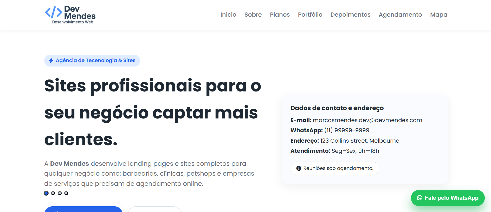

# Dev Mendes — Next.js

Landing page B2B redesenhada com foco em credibilidade, conversão, acessibilidade e desempenho.

## Stack atual

- Next.js 16 com App Router e renderização estática
- React 19 e TypeScript
- Tailwind CSS 4
- Motion carregado sob demanda para animações de entrada
- Lucide React para ícones
- Geist auto-hospedada

## Requisitos e comandos

- Node.js `24.21.0` LTS, registrado em `.nvmrc` e `.node-version`
- npm 11 ou superior

```bash
npm install
npm run dev
npm run lint
npm run build
```

O código atual está organizado em `app/`, `components/`, `lib/` e `public/`. As antigas URLs `.html` são redirecionadas para as rotas do App Router.

---

## Histórico da versão estática


# 🚀 Dev Mendes — Agência de Tecnologia & Desenvolvimento de Sites

Este repositório contém o código-fonte do site oficial da **Dev Mendes**, uma agência especializada em criar sites profissionais, landing pages de alta conversão e integrações inteligentes para negócios locais como clínicas, barbearias, estúdios, lojas e empresas de serviços em geral.

O projeto foi desenvolvido para demonstrar minhas habilidades em **Front-end**, **Design Responsivo**, **Interatividade Web**, utilizando tecnologias modernas e uma estrutura limpa e escalável.

---

## 🖥️ **Tecnologias Utilizadas**

### **Front-end**
- **HTML5** — Estrutura semântica organizada e modular
- **CSS3 (customizado)**  
  - Layout responsivo (mobile-first)  
  - Animações suaves  
  - Grid e Flexbox  
  - Menu hambúrguer com transição *slide-in*
- **JavaScript (Vanilla)**  
  - Controle do menu mobile  
  - Carrossel com dots interativos  
  - Scroll suave  
  - Abertura de WhatsApp para agendamentos

### **Ferramentas e APIs**
- **Google Fonts** (Poppins)
- **Font Awesome 6** (ícones de interface)
- **Google Maps Embed API** (mapa integrado)
- **WhatsApp API** para automação do botão de contato

---

## 📱 **Responsividade**

O site foi totalmente projetado para funcionar perfeitamente em:

- 📌 Monitores grandes (desktop)
- 💻 Laptops
- 📱 Smartphones
- 📲 Tablets

A responsividade foi implementada manualmente com CSS puro, utilizando *breakpoints* específicos no final do arquivo, garantindo uma experiência fluida em qualquer dispositivo.

---

## 🧩 **Funcionalidades Principais**

### ✔️ Menu Mobile com Animação Hambúrguer/X  
- Animação suave apenas com CSS  
- Overlay deslizando da direita  
- O menu não empurra o conteúdo — ele sobrepõe  
- Fecha automaticamente ao clicar em um link

### ✔️ Carrossel Automático com Dots  
- Totalmente em JavaScript  
- Transições suaves  
- Dots que indicam o slide ativo  
- Mobile-friendly

### ✔️ Botão Fixo do WhatsApp  
- Com ícone do Font Awesome  
- Abre diretamente o WhatsApp com mensagem pré-pronta  
- Excelente para captação de leads

### ✔️ Formulário de Agendamento  
- Dados preenchidos pelo usuário são enviados para o WhatsApp  
- Evita uso de backend  
- Melhor conversão para negócios locais

### ✔️ Sessões com efeitos Reveal  
- As seções aparecem suavemente conforme o usuário rola a página  
- Criado com JavaScript + CSS transitions

---

## 📂 **Estrutura do Projeto**

```sh
.
├── index.html
├── css/
│ └── style.css
├── img/
│ ├── logo-transparente.png
│ ├── favicon.png
│ └── imagens diversas
├── script/
│ ├── menu.js
│ ├── carousel.js
│ ├── reveal.js
│ └── script.js
└── README.md
```
---

## 🧠 **Aprendizados e Melhorias Implementadas**

Este projeto foi construído com foco em:

- Organização modular de código  
- Componentização do layout  
- Separação clara de responsabilidades entre CSS e JS  
- Manutenção de responsividade sem frameworks (CSS puro)  
- Boa prática de UX para conversão e agendamentos  
- Controle manual do DOM sem bibliotecas externas  

Também foram corrigidos desafios importantes:

- Quebra no layout mobile  
- Sobreposição correta do menu  
- Ajuste do grid na seção HERO  
- Animação do botão sanduíche  
- Eliminação de scroll horizontal  
- Aumento da acessibilidade (aria-labels, contraste, espaçamentos)

---

## 🌐 **Como Rodar o Projeto**

Você pode escolher uma das duas opções:

### **1 — Clonar o repositório**
```sh
git clone https://github.com/seuusuario/dev-mendes-landingpage
```
### **2 — Pode simplesmente acessar:**
```sh
https://dev-mendes.vercel.app/
```


---

## 🎯 **Objetivo do Projeto**

O propósito deste site é:

- Mostrar habilidades profissionais em front-end.  
- Demonstrar domínio de responsividade avançada.
- Criar uma base sólida para agência/negócio real.
- Apresentar uma interface moderna focada em conversão de clientes reais.
- Ser divulgado no **LinkedIn**, **portfólio** **entrevistas** e **propostas comerciais**


---

## 📞 Contato

Caso queira trocar ideias ou colaborar:

- **E-mail:** marcosmendes.dev@devmendes.com  
- **LinkedIn:** https://www.linkedin.com/in/marcosmendes44/

---

⭐ Contribua

Se gostou do projeto, não esqueça de deixar uma estrela no GitHub ⭐
Isso me ajuda a crescer e continuar produzindo novos projetos!

--- 

## 🏆 Licença

Este projeto é **livre para estudo**, mas não pode ser copiado como marca comercial.

---

*Version English*

# Dev Mendes — Modern Web Development Agency  
A responsive website project built to represent my fictional/portfolio web development agency **Dev Mendes**, focused on building fast, clean, conversion-optimized websites for small businesses.

This project was entirely designed and developed by me as a way to practice layout design, modern front-end development, responsive UI structure, and user-focused business communication.

---

## 🚀 Features

### 🎨 **Modern, clean, responsive UI**
- Fully responsive layout (desktop, tablet, mobile)
- Organized CSS architecture with media queries at the bottom
- Custom hero section with text carousel and animated dots
- Professional pricing table
- Testimonial section
- Interactive WhatsApp button

### 📱 **Mobile-first Navigation**
- Animated hamburger menu  
- Overlay mobile navigation panel  
- Smooth transitions and fluid UX  

### 🧩 **Components**
- Hero section with animated text slider  
- Contact card  
- Portfolio grid  
- Pricing cards  
- Testimonials  
- WhatsApp floating action button  
- Custom footer with social icons and contact information  

---

## 🛠️ Technologies Used

### **Front-end**
- **HTML5**  
- **CSS3 (Flexbox, Grid, Responsive Design)**  
- **JavaScript (ES6)**  
- **Font Awesome** for icons  
- **Google Fonts – Poppins**  

### **Other UI/UX Improvements**
- Scroll reveal animation  
- Animated mobile menu  
- Modular JavaScript files  
- Smooth scroll behavior  

---

## 📂 Project Structure

/project-root
│
├── index.html
├── css/
│ └── style.css
├── script/
│ ├── menu.js
│ ├── carousel.js
│ └── reveal.js
├── img/
│ ├── logo-transparente.png
│ ├── favicon3.png
│ └── portfolio images...
└── README.md


---

## 🔗 WhatsApp Integration

The project includes:  
- A floating WhatsApp button  
- Automatic WhatsApp redirect on form submit  
- WhatsApp link in footer and navigation menu  

---


---

## 📌 Purpose of the Project

This website serves as:
- A **portfolio piece** to demonstrate front-end skills  
- A **mock business website** to showcase what clients could request  
- A **learning environment** for improving UI, animations, and responsiveness  
- A **personal brand builder** for my LinkedIn and GitHub  

It simulates a real small digital agency, representing how I would deliver websites to clients.

---

## 📬 Contact

If you want to connect, feel free to message me!  

**Email:** marcosmendes.dev@devmendes.com  
**LinkedIn:** *[your profile link](https://www.linkedin.com/in/marcosmendes44/)*  

---

## 📄 License
This project is for educational and portfolio purposes only.


